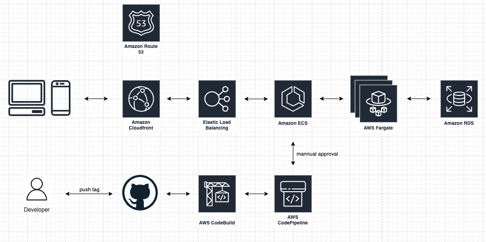

# SAAS Subscription Server Infra


### Prerequisite

- Node.js 16.19.0


### Local Development

- Prepare Following Environment Variables
  - PRIVATE_KEY_PATH_BASE64_STR
  - PUBLIC_KEY_PATH_BASE64_STR
  - SWAGGER_USERNAME
  - SWAGGER_PASSWORD
  - SYSTEM_API_KEY
  - TAP_PAY_MERCHANT_ID
  - TAP_PAY_PARTNER_KEY


- npm install


- cdk diff
  
  ```
  RIVATE_KEY_PATH_BASE64_STR= \
  PUBLIC_KEY_PATH_BASE64_STR= \
  SWAGGER_USERNAME= \
  SWAGGER_PASSWORD= \
  SYSTEM_API_KEY= \
  TAP_PAY_MERCHANT_ID= \
  TAP_PAY_PARTNER_KEY= \
    npx cdk diff
  ```


- cdk deploy

  ```
  PRIVATE_KEY_PATH_BASE64_STR= \
  PUBLIC_KEY_PATH_BASE64_STR= \
  SWAGGER_USERNAME= \
  SWAGGER_PASSWORD= \
  SYSTEM_API_KEY= \
  TAP_PAY_MERCHANT_ID= \
  TAP_PAY_PARTNER_KEY= \
    npx cdk deploy
  ```


### Architecture Diagram

 
